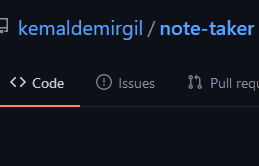

# Note Taker

### About:
This is a simple **Note Taker** app that allows users to add their notes to a globally open server(Heroku). The user can later edit, delete and post new notes if desired. The point of this application was to use `Express.js` and get used to creating servers and running them on `Heroku`. During the construction of this application, I've used 3 dependencies and additionally `nodemon` in my *devDependencies* to run my code on `Node.js`.

#### Dependencies:

### Usage:
1. Please click on the `START` button to navigate to the notes page,
2. Enter a desired title and description,
3. Click on the save button in the upper right corner of the page,
4. To edit your note simply click on the title of your note on the left panel, then edit on the input area

### Demo:
##### Link: https://salty-earth-55682.herokuapp.com/

### Issues:
If you get to accross any issues, please simply leave a ticket and I would love to get to is as soon as possible.\

### Improvements:
> There are some bugs that could be eventually fixed however, the front-end of the application wasn't the main focus in this project. The console gives and `404 Not Found` error when loading the page to find the `'favicon'`. I believe that's coming from `Heroku` itself, I could've added a simple `favicon` icon to get rid of it, but I simply thought it's not necessary.

### License:
Copyright © Kemal Demirgil. All rights reserved.
Licensed under the [MIT](https://github.com/kemaldemirgil/remember-me/blob/main/LICENSE) license.
